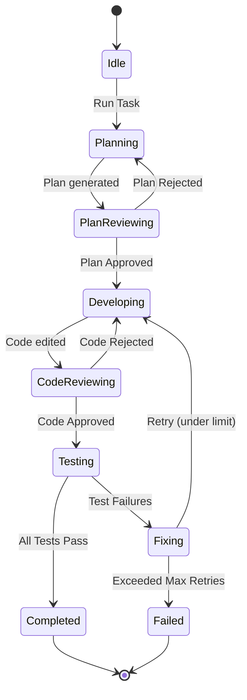

# Grok-talk Development Agency (v2: Adaptive State Machine)

Welcome to the **Grok-talk Development Agency v2**, a self-correcting multi-agent framework designed to safely and continuously evolve the **FusionPanda Master** web application. 

Version 2 introduces closed-loop feedback systems, multi-stage Critic review gates, an automated Fixer agent to remediate test failures, and a persistent Evolutionary Memory Bank to learn from successes and failures.

---

## 🏢 Hierarchical Architecture Layers

```
              ┌─────────────────────────────────────┐
              │      Orchestration Layer (CLI)      │
              │  Risk Assessor • ACP State Machine  │
              └──────────────────┬──────────────────┘
                                 │
         ┌───────────────────────┼───────────────────────┐
         ▼                       ▼                       ▼
┌─────────────────┐     ┌─────────────────┐     ┌─────────────────┐
│ Memory Layer    │     │ Execution Layer │     │ Governance Layer│
│ tasks.json      │     │ Architect       │     │ Observability   │
│ task_state.json │ ──➔ │ Developer       │ ──➔ │ Failure Heatmap │
│ git repo history│     │ QA / Tester     │     │ Memory Bank     │
└─────────────────┘     └─────────────────┘     └─────────────────┘
                                 ▲
                                 │
                      ┌──────────────────┐
                      │ Review & Fix     │
                      │ Critic (Plan)    │
                      │ Critic (Code)    │
                      │ Fixer (Patches)  │
                      └──────────────────┘
```

1. **Orchestration Layer**: Orchestrates state transitions, analyzes tasks for risk metrics, and handles agent escalation.
2. **Memory & Context Layer**: Integrates persistent task backlogs (`tasks.json`), live runtime state tracking (`task_state.json`), and project-scoped Git repository checkpoints.
3. **Execution Layer**: Specialized subagents (Architect, Developer, Gameplay Tactician, Tester) carrying out coding and gameplay optimization tasks.
4. **Review & Correction Layer**: Proactive Critics checking planning models and developer code diffs, and the Fixer agent restoring workspace integrity and generating patches on test regressions.
5. **Observability & Governance Layer**: Logs transition traces (`traces/`), measures failure categories (Failure Heat Map), and writes global patterns (Evolutionary Memory Bank).

---

## 👥 Roster of Specialized Agents

* **Orchestrator**: Core engine enforcing transitions, risk evaluations, and recovery paths.
* **Architect**: System designer mapping state schemas and drafting plan specs to `plans/`.
* **Plan Critic**: Gates design models. Reviews structure, safety guards, and stub definitions.
* **Developer**: Codifies edits using diff-based modifications.
* **Code Critic**: Inspects changesets for syntax correctness, reference matches, and DOM-safe guards.
* **Gameplay Tactician**: Optimization specialist auditing and refining combat balancing, controls responsiveness, latency reduction, and visual aesthetics.
* **Tester**: Verifies structural layout builds and executes assertion pipelines.
* **Fixer**: Parses test/compilation errors, proposes repairs, rolls back bad code, and requests retries.

---

## 🔄 Adaptive Workflow (ACP State Machine)

The agency executes tasks through the **Agent Communication & Orchestration Protocol (ACP)**:



---

## 📂 Directory Structure

* **`roles/`**: Instructions defining agent capabilities (**[architect.md](roles/architect.md)**, **[developer.md](roles/developer.md)**, **[tester.md](roles/tester.md)**, **[critic_plan.md](roles/critic_plan.md)**, **[critic_code.md](roles/critic_code.md)**, **[fixer.md](roles/fixer.md)**).
* **`plans/`**: Task plans drafted by the Architect and verified by the Plan Critic.
* **`traces/`**: JSON execution traces storing timestamps and metadata for every state transition.
* **`orchestrator.js`**: Core Node.js state machine running the agency CLI.
* **`tasks.json`**: Backlog archive.
* **`task_state.json`**: Temporary metadata for active workflows.
* **`failure_heatmap.json`**: Real-time failure category analytics (misalignment, design, verification, coordination).
* **`evolutionary_memory.json`**: Global cache of successful patterns, anti-patterns, and learnings.

---

## 🛠 Usage Instructions

You can run the agency and inspect performance metrics using the CLI:

### 1. File a Task & Run Workflow
Add a task to the queue and execute it:
```bash
node agency/orchestrator.js add "My Feature" "Description"
node agency/orchestrator.js run task_003
```

### 2. Monitor Active Tasks & Traces
Inspect the current status and transition logs of a running workflow:
```bash
node agency/orchestrator.js status
```

### 3. Review Failure Analytics & Memory
Analyze error distributions and read continuous learnings across runs:
```bash
node agency/orchestrator.js heatmap
node agency/orchestrator.js memory
```

---

## 🔌 Protocol Stack

* **MCP (Multi-Context Protocol)**: Governs secure file reading, command running, and Git checkpoint tracking.
* **A2A (Agent-to-Agent Protocol)**: Enables message and critique loops between subagents (Architect-to-Critic, Developer-to-Fixer).
* **ACP (Agent Communication & Orchestration Protocol)**: Core state transition schema driving state progression, retry thresholds, and closeout archives.
